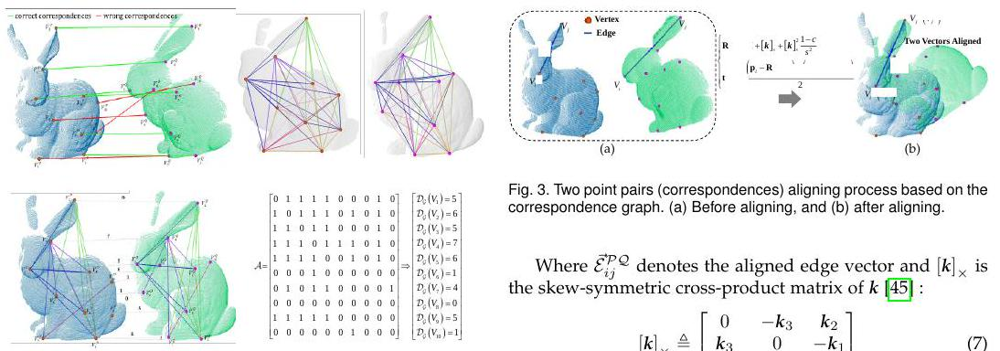
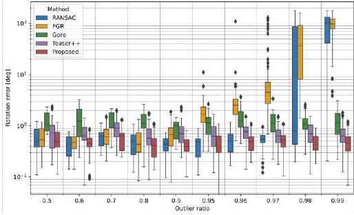

- A New Outlier Removal Strategy Based on Reliability of Correspondence Graph for Fast Point Cloud Registration

# 简介
- 论文通过引入对应图的可靠性的概念减少outlier ratio，从而提高点云匹配的精确度

## 获得点云集P，Q的对应点
1. 对点云集做降采样处理
2. 使用ISS算法获得对应的关键点
3. 从而得到关键点的源点云集和目标点云集，分别为$Q = \{q_i\}^n_1$, $P = \{p_j\}^m_1 $
4. 使用FPFH描述关键点和它neighbors之间的关系
5. 基于关键点的FPFH向量和K-D tree 建立点云集的对应关系$H= \{(p_i,q_i)\}^N_1$

## 通过对应图节点的可靠性优化选择策略
1. 由上述生成的对应点云集：$H= \{(p_i,q_i)\},i[1,N]$，分别生成两个无向完全图$G^p(V^p,E^p)$和$G^p(V^q,E^q)$,[注]$G(V,E), 其中G表示图，V表示节点，E表示边$
2. 连接两个无向图的对应节点$(V^{p_i},V^{q_i}),(V^{p_j},V^{q_j})$,两个无向图所对应的边$(E^{p_{ij}},E^{q_{ij}})$
3. 对比对应边的欧式距离，理论来说$||E^{p_{ij}}-E^{q_{ij}}||=0$,但考虑到误差，将$||E^{p_{ij}}-E^{q_{ij}}||<\sigma$的两个边称为对应边
4. 引入邻接矩阵A(a)，$a_{ii}=0$;  $if(||E^{p_{ij}}-E^{q_{ij}}||<\sigma)\{a_{ij}=1\}else\{a_{ij}=0\}$
5. 由4，生成的是对称矩阵可以作为对应图的邻接矩阵，它的节点的度可以反映对应图的可靠性；度越大，欧式距离约束的越好;$节点i的度表示为:D(V_i)=\sum_{j=1}^{N}a_{ij},a_{ij}\in A$
6. 将度的大小按照降序排序，选取前K个对应点作为可靠的(reliable)对应点生成对应点云集：$H_r= \{(p_i,q_i)\}^K_1$

## 用可靠的点云集做点对点对齐
1. 理论上三对对应点，可以求解出R，t（实际需要更多）
2. 第一对点可以估计平移（translation），自由度由6降低到3
3. 平移后的第二对点是通过对应点分别的第一点到第二点的向量a,b，叉乘(cross-product)得到垂直两者的向量作为旋转轴；$旋转角度：θ_{ab} = arccos (a·b/|a||b|)$;这一步记为：$R_1$，自由度由3降低到1
4. 与3）相似，也是通过旋转轴和旋转角度，可以a做旋转轴，至于旋转角度，因为还有K-2个点还未对应，所以作者归一化Z轴，以Z轴作为旋转轴，(K-1)个点就可以有Z-1个$\theta 角$，选取一个拟合度最高的角度，以达到(k-2)个点对齐的更好;
- - 作者参考的论文：[paper]:(https://doi.org/10.1016/j.isprsjprs.2018.11.016)

## 点对点对齐图解

# 论文对齐参考图

# 性能对比
- 旋转

- 平移
.jpg)

- 时间
.jpg)

 # 代码框架
 - 暂时未看
 
