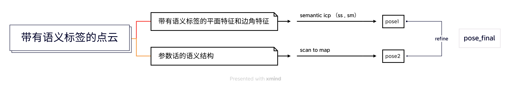

- 语义slam开发流程及计划

## 流程图
1. 通过rangenet++等语义分割模型获得带有语义标签的点云信息，结合loam 前端做一个semantic icp, 获得初始pose1.
2. 参考未开源的SA-LOAM: Semantic-aided LiDAR SLAM with Loop Closure论文做法，参数化语义结构，scan to semantic map,获得pose2.通过1,2获得最终的refined pose.
3. 流程图如下：

## 计划
1. 至2022.09.10 从模型获得标签，完成基本的semantic icp 的代码开发
2. 至2022.09.25 完成参数化的语义结构
3. 至2022.09.30 调试，完成初版的语义slam

## 目前状态
- 由于通过模型推理获得语义信息一帧需要：270-280ms，加上检索标签一帧需要：300+，没办法录制10hz的kitti-bag
- 降低kitti数据集到1/10,先缓存标签 后与kitti做semantic bag，5G显存在缓存标签时，程序跑不完就会崩溃
- 目前在与研究院沟通，尝试其他模型获得点云标签
