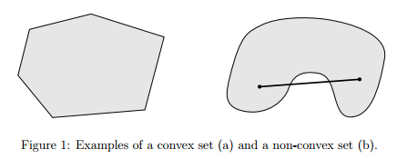
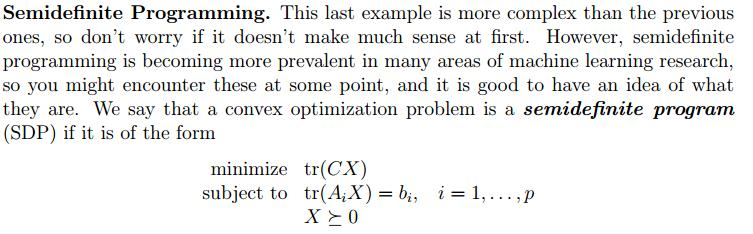

# 一：论文概述
- TEASER: Fast and Certifiable Point Cloud Registration
## 本论文具有以下几个特点：
1. 提出第一个快速且可证明的点云配准算法，对于存在大量外点对应的情况鲁棒
2. 使用截断最小二乘(TLS)代价函数将点云配准问题重新建模，因为有引入噪声参数，使得估计对大量假对应点不敏感
3. 提供一个通用的图理论框架将尺度、旋转和平移估计解耦，这样就可以级联地求解三个变换
4. 配准速度快，（作者认为是目前最快的，最鲁棒的配准算法）
5. 作者认为该方法可以在机器人中实时的运行使用

## 证明及贡献
1. 使用adaptive voting机制能够在多项式时间内精确地求解标量例子的TLS估计问题，这就能够高效地进行尺度和分量形式平移的估计。
2. 建立一个紧的半定规划(SDP)松弛去估计旋转，同时建立一个后验条件去检测松弛的质量
3. 作者：我们的SDP松弛是第一个用于鲁棒旋转搜索问题的可证明算法
4. 验证我们称为截断最小二乘估计和半定松弛算法返回解的质量的一系列理论结果
5. 实现TEASER的一个快速版本，称为TEASER++，使用渐进非凸(GNC)估计旋转而不需要求解大规模SDP

## 论文核心
1. 使用截断最小二乘（Truncated Least Squares） （TLS）cost来重新描述了配准问题。使得该方法对大部分的虚假对应不敏感，但会形成了一个hard，组合的，非凸的最优化问题。
2. 设置了一个将尺度，旋转和平移解耦的通用图论框架。该算法允许级联求解三个变换，每个子问题（尺度，旋转和平移）在本质上还是非凸优化问题。每个子问题分别求解

# 二：论文细节
## 使用截断最小二乘重新描述问题
在点云配准问题中：给定两个点云集$A=\{a_i\}^N_{i=1} 和 B=\{b_i\}^N_{i=1},且a_i, b_i∈R_3$.
作者建立生成模型使得对应点对$(a_i, b_i), i = 1,...,N$服从于它，模型如下：
$$
b_i = s^◦R^◦a_i + t^◦ + o_i + \epsilon _i
$$
- 其中$s^◦>0,R^◦ \in SO(3),t^◦\in R_3$是未知的（需要去求解的）尺度，旋转，和平移.
- $\epsilon _i 模型是预测噪声的$
- 如果点对$(a_i, b_i)$是inlier，$o_i$是零向量;如果点对$(a_i, b_i)$是outlier，$o_i$是任意向量

---

假设$\epsilon _i$是零均值带有各项同性协方差$\sigma ^2_i$的高斯噪声,那$(s^◦,R^◦,t^◦)$的最大似然估计可以通过非线性最小二乘问题解决：建模为：

$$\min _{s>0, \boldsymbol{R} \in \mathrm{SO}(3), \boldsymbol{t} \in \mathbb{R}^{3}} \sum_{i=1}^{N} \frac{1}{\sigma_{i}^{2}}\left\|\boldsymbol{b}_{i}-s \boldsymbol{R} \boldsymbol{a}_{i}-\boldsymbol{t}\right\|^{2}
$$
- 但是这个模型对outlier太敏感;基于此，作者提出截断最小二乘配准方法，此方法可以容忍极端的假数据

---
作者放弃了高斯噪声模型，假设噪声是未知，但是有界的$\beta _i$,假设inlier噪声$|| \epsilon _i|| < \beta _i$，$\beta _i 即噪声边界$。如此TLS配准公式设计如下：
$$\min _{s>0, \boldsymbol{R} \in \mathrm{SO}(3), \boldsymbol{t} \in \mathbb{R}^{3}} \sum_{i=1}^{N} \min (\frac{1}{\beta_{i}^{2}}\left\|\boldsymbol{b}_{i}-s \boldsymbol{R} \boldsymbol{a}_{i}-\boldsymbol{t}\right\|^{2},c^{-2})
$$
- one can safely assume $c{¯2}$ to be 1. For the sake of generality, in the following we keep $c{¯2}$, since it provides a more direct “knob” to be stricter or more lenient toward potential outliers
- 噪声边界$\beta _i$一般可以设置为$3\sigma$作为最大误差 

## 将尺度，旋转和平移解耦

# 三：框架逻辑

# [注]：
1. 凸优化问题（OPT，convex optimization problem）指定义在凸集中的凸函数最优化的问题，对于凸优化问题来说，局部最优解就是全局最优解。
2. 非凸优化问题(non-convex optimization problem):对于非凸问题进行优化通常有以下三种传统的方法
- - 在每次迭代的过程中，只针对一个变量进行优化求解，其余变量保持不变，然后交替求解
- - 将目标函数在定点进行一阶泰勒展开，然后构建近似函数，近似函数代替原目标函数进行求解
- - 引入松弛变量，将原目标函数中难以解决的公式部分用松弛变量代替，使目标函数变为凸函数
3. semidefinite program(SDP),半正定规划:半定松弛Semidefinite relaxation（SDR）将非凸问题凸化，得到SDP问题

- 凸集与非凸集

- 半正定规划（SDP）例子

