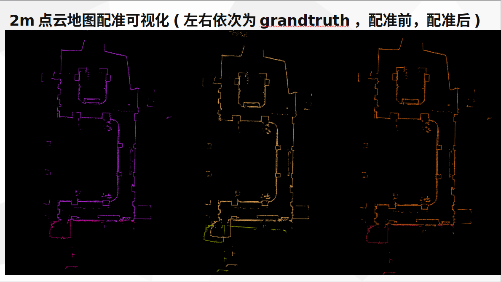
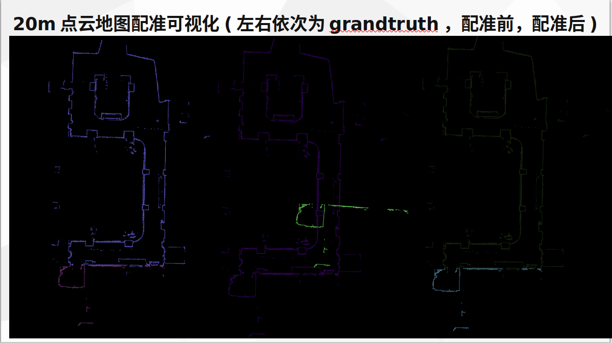

- 关于全局配准用于机器人开机定位和回环检测的总结

# 一个半月探索流程

### 1-2周看了几篇全局配准的论文，了解一些局部配准算法，和学习ros基本命令及通信原理

- TEASER: Fast and Certifiable Point Cloud Registration
- A Single Correspondence Is Enough: Robust Global Registration to Avoid Degeneracy in Urban Environments
- PHASER: a Robust and Correspondence-free Global Pointcloud Registration
- A New Outlier Removal Strategy Based on Reliability of Correspondence Graph for Fast Point Cloud Registration

### 3-4周学习写ros节点用于接收laserscan转teaser数据格式用teaser配准
- 这两周先是学习了ros1节点编程，学习PL-ICP激光里程计(TF变换还要继续看).
- 熟悉ros写节点之后，把效果比较好的teaser全局配准用于ros中

### 5-6周在模拟scan帧与点云地图 和 真实scan与点云地图中做测试实验
- 其中在模拟时效果很好, 真实scan中效果不好
- 后面给出实验结果和分析

# 全局配准与局部配准
### 全局配准
- 全局配准的优点是 它是全局的，不会陷入局部最优
- 全局配准的缺点是 耗时较长，另一个就是非常依赖好的关键点做对应点对
- 一般全局配准流程为：1.点云降采样(可选),2.提取关键点，生成两点云的对应点对，3.全局配准算法做配准

### 局部配准
- 局部配准的优点是 速度快 适合近距离配准
- 局部配准的缺点是 不一定收敛 距离远时迭代次数增加
- 以最近点做对应点对，一次一次迭代，直到达到设置的迭代次数或者达到设置的可接受阈值

# 模拟scan帧与点云地图 和 真实scan与点云地图中做测试实验
### 在模拟scan帧与点云地图测试实验中
- 对2D点云地图做了不同T(R和t:2,5,10,20m)测试，得到一些数据和可视化显示,下面t分别为2m 和20m的可视化和R，t误差数据

- 2m点云地图配准可视化(左右依次为grandtruth，配准前，配准后)


- 2m R，t误差数据
```
Expected rotation: 
  0.996927  0.0668736 -0.0406664
 -0.066129   0.997618  0.0194009
 0.0418676 -0.0166518   0.998978
Estimated rotation: 
  0.996932   0.066874 -0.0406671
-0.0661289   0.997622  0.0194006
 0.0418678 -0.0166519   0.998984
Error (deg): 0.00412218

Expected translation: 
 -1.4242
-1.32422
0.092333
Estimated translation: 
  -1.4242
 -1.32416
0.0923319
Error (m): 5.57471e-05

Time taken (s): 0.268507
```
---
---

- 20m点云地图配准可视化(左右依次为grandtruth，配准前，配准后)


- 20m R，t误差数据
```
Expected rotation: 
  0.996927  0.0668736 -0.0406664
 -0.066129   0.997618  0.0194009
 0.0418676 -0.0166518   0.998978
Estimated rotation: 
  0.996932   0.066874 -0.0406671
-0.0661289   0.997622  0.0194006
 0.0418678 -0.0166519   0.998984
Error (deg): 0.00412218

Expected translation: 
 14.0344
 14.0123
0.092333
Estimated translation: 
  14.0344
  14.0124
0.0923319
Error (m): 5.55539e-05

Time taken (s): 0.655565
```
***可以看到2m 和 20m的精度基本差不多，时间上距离越远耗时越多。***

### 在真实scan帧与点云地图测试实验中
- 在对真实的LaserScan帧点云数据与点云地图配准中，效果很差;如对一个平移两米的尺度在teaser中做预测R和t：结果预测的t误差比2m还多，完全失败; 
- 看了teaser的估计R 和t的源码发现源码内部有用到的对应点对(Correspondences:用于求解R和t所必要的两点云间的对应关系)需要自己提供，没提供就默认前M个点云间为对应关系(假设点云A.size() =M,点云B.size() = N, N >M)
- 然后通过FPFH提取两点云间的特征点建立对应点对，投入到teaser中，效果不佳，这就是目前所遇到的问题。(目前猜测 是因为 用FPFH估计的对应点对的正确率太低所导致的)

### 解决的想法
1. 想法是：对点云地图降采样，然后重新与LaserScan点云数据建立对应关系 或者查阅点云特征点提取相关论文，找到比FPFH对于我需要的场景更有效的关键点提取方案(基于学习的点云特征点提取效果很不错，目前没打算这个)，然后做一些实验测试，如果效果不错，则解决问题。
2. 如果没有解决问题，但是预估的R和t(尤其是t误差可以控制在1m范围以内),可以尝试使用此估计的R和t作为初始配准然后使用使用局部配准方案作为精配准（因为局部配准的特点是在两点云间距离较近时，1.迭代次数少;2.不易陷入局部最优解）

### 验证想法
1. 降采样之后只是减少了配准时间，精度没有提升
2. 关于是否换其他算法提取关键点，做了测试实验发现两个点云物理场景越接近(不要求完全一致)，提取关键点得到对应点对而后全局配准 配准的效果越好(这里有特意打乱对应索引)。
3. 因为全局配准的精度太差，使用全局+局部配准的意义不大。

# 总结
全局配准无法用在机器人开机定位和回环检测的本质原因是：分别在点云地图场景和scan中提取的关键点没办法得到有效的对应点对，从而配准失败。